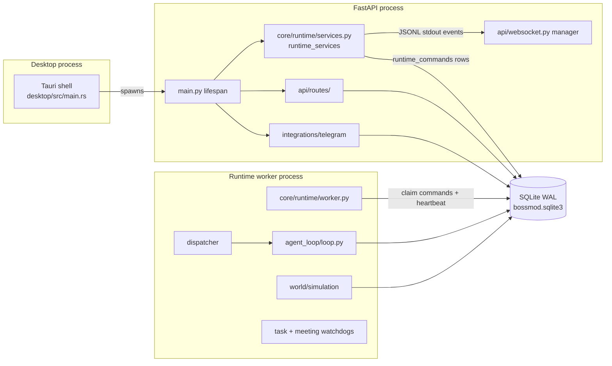
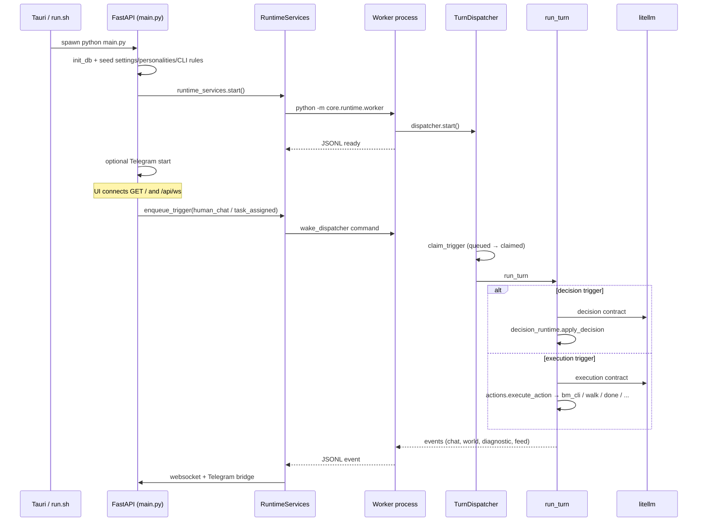
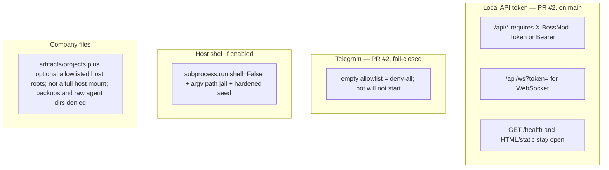

# BossMod AI — Current-state architecture

**As of:** current tree after PR #2 and the HA-* health landings (2026-09-05). This is a map of what exists, not a target design. [`HEALTH_AUDIT.md`](HEALTH_AUDIT.md) is a **snapshot** of `main` @ `f5405bc` and is not current for security status.

## Process topology

Two Python processes share one SQLite file. The app process owns HTTP, WebSocket, Telegram, and settings. The worker owns the agent loop, world tick, and watchdogs. They coordinate through `runtime_commands` / `runtime_worker_state` plus a JSONL event pipe on the worker's stdout.

**Quit.** Window close or one Ctrl+C on `./run.sh` returns to the shell once. `run.sh` stays in the foreground and SIGTERMs the desktop (its own process group). The desktop SIGTERMs the backend only — uvicorn runs FastAPI lifespan → `runtime_services.stop()` → `shutdown_runtime` — waits a short grace, then signals leftover PIDs that still match this repo’s `main.py` or `core.runtime.worker`. The worker also handles SIGTERM/SIGINT by setting its stop event, so it should not print “lost its parent process” after the prompt. Process-tree smoke: `uv run pytest -q tests/test_clean_exit.py`.

## Boot → first agent turn

## Major packages

| Package | Role today |
| --- | --- |
| `main.py` | FastAPI app, lifespan, `/` + `/health`, binds `127.0.0.1:38471` |
| `api/` | Split routers under `api/routes/` (`ws`, `agents`, `tasks`, `company_files`, `settings`, `cli_policy`, `runtime`) + WebSocket manager. Largest leftover: `agents.py` (~808 LOC). |
| `core/runtime/` | App↔worker gateway (`RuntimeServices` singleton) and worker loop |
| `core/agent_loop/` | Trigger dispatch, decision/execution turns, meetings, channels, watchdogs |
| `core/bm_cli/` | Virtual CLI + optional host shell + managed writer |
| `core/tasking/` | Create/bind tasks, board, resolution |
| `core/llm/` | Context assembly, template engine, litellm client, routing |
| `core/world/` | Tilemap + A* movement tick |
| `core/config.py` | Process-wide settings cache over `settings` table |
| `db/` | SQLite access; `db/__init__.py` re-exports ~200 symbols |
| `integrations/telegram/` | Bot commands, in-memory chat sessions, approval buttons |
| `ui/` | Vanilla JS IIFEs + vendored Tailwind/Lucide/Split + Jinja `index.html` |
| `desktop/` | Tauri 2 wrapper; records backend PID; ordered SIGTERM → lifespan → leftover kill on quit |
| `prompts/` | Authored contracts, personalities, internal repair/continue text |
| `plugins/` | Empty directory (no plugin loader) |

## Coupling hotspots

- **God objects / process globals:** `runtime_services`, `dispatcher`, `simulation`, `watchdog`, `meeting_watchdog`, `policy_engine`, `manager` (WebSocket), `runtime_events`, `config._cache`.
- **Layer inversion:** `RuntimeServices` broadcasts through an `EventSink` set in `main.py` lifespan (`set_event_sink(manager)`). `core/` does not import `api`. Worker code still aliases `runtime_events as manager` so the same call sites work in both processes.
- **Barrel import:** almost all persistence goes `import db` → `db/__init__.py`. Easy to call, hard to fake in tests.
- **Dual enqueue:** API/Telegram use `runtime_services.enqueue_trigger` (cross-process). Worker-side watchdogs/meetings use `dispatcher.enqueue_trigger` (in-process). Correct given the split; easy to call the wrong one from new code.
- **Lazy imports** inside functions (`from core.world.simulation import simulation`, `from core.bm_cli.runtime import execute_approved_command`) paper over cycles rather than invert dependencies.

## Trust boundaries (current tree)

**Shipped on `main` (do not describe as open):**

- **PR #2** — local API token (`X-BossMod-Token` / `Authorization: Bearer`) on `/api` REST and WebSocket; settings/connections redact secrets; Telegram empty allowlist is deny-all and refuses start.
- **HA-SEC-P0-04** — company browser root is `artifacts/projects`; `db_backups/` and raw `agents/` are outside it.
- **HA-SEC-P0-03 / HA-SEC-P1-04** — shell path jail; interpreters / `xargs` / POSIX shells are `never_allowed`; argv[0] basename matching.

Day-one workspace (see [`CAPABILITY_PASS.md`](CAPABILITY_PASS.md)): a user-named absolute path can be opened/read/edited when it stays under `/me`, `/projects`, or operator-configured Host workspace roots (Company Files or Settings → CLI Policy; same `workspace_host_roots` allowlist). Extra roots default to empty. This is an allowlisted-roots model, not a full host mount. Capability item 3 proves a host-path task can be assigned peer-to-peer: the assignee is woken, edits under the allowlisted root, and a completion + artifact is observable — via the same APIs/actions/triggers the live loop calls, not a dual-LLM GUI run. Paths outside the allowlist stay denied.

Residual (not “auth is missing”): `/health` and the HTML/static UI stay unauthenticated by design. Connection-test URLs are allowlisted (HA-SEC-NEW-01, shipped). Every HA-* item in [`HEALTH_BACKLOG.md`](HEALTH_BACKLOG.md) is shipped on current `main`; that file is the historical sequence plus out-of-scope notes, not an open queue. See [`HEALTH_VERIFICATION.md`](HEALTH_VERIFICATION.md) for the latest verification pass.

## Role contracts v1

Hire captures a short contract, not a megaprompt. Casual hire fields are Name, Specialty (`Agent.role`), Description, and Color. Color defaults to the next unused roster palette color (then rotates) and stays editable. `done_fail_bar` is optional “what done looks like”; it is not required up front. The hire form suggests a default from specialty (and description when useful) and never silently rewrites operator edits. That field, the long prompt/`prompt_template`, and desk sit under Advanced. Blank `done_fail_bar` is valid; empty done is still rejected by the checkable-claim rules. Hire auto-assigns an unoccupied map desk when none is chosen and one is free; it never takes a desk already claimed by another agent.

Assign / peer-assign / work-plan routing (`POST /api/tasks`, `delegateTask`, accepted work plans) prefer a matching specialty when title/description (or `requested_specialty`) infers a work kind. A clear mismatch is a soft-deny: 409 `specialty_mismatch` on the operator Assign Task path, or `world_feedback` on peer actions, with suggested teammates. The Assign Task form shows an inline mismatch warning as title/assignee change, ranks matching specialties first, and keeps the confirm (`confirm_specialty_mismatch` / `confirmSpecialtyMismatch`) override. Coordinate specialties (lead/PM) and uninferable work stay unknown — no silent “every agent can do everything,” and no false deny.

Complete / deliver on the existing `done` path requires a checkable claim. A satisfied work-contract file deliverable counts. Otherwise the action must attach `data.claim` `{type: artifact|tests|proof, path?, ev?}`. Empty done is rejected. The task-detail panel surfaces the assignee specialty, what done looks like, and what claim is missing (or the attached claim when complete). Auditor-style specialties (review/audit/qa) CLEAR only through this same complete path; v1 does not add a separate CLEAR protocol.

Every turn injects a Role contract system message (specialty + what done looks like + assign/complete hard rules) so live databases pick up the behavior without reseeding prompts. Refused empty-done and mismatch `world_feedback` is visible in the activity feed.

## Runtime core and host-path consent

A shared runtime core is injected every turn beside the Role contract: identity (name + specialty), desk/`/me`, allowed tools, host-path consent, and checkable done. Role-specific quality bars stay in Description. Hire Advanced shows the core as a read-only preview.

Out-of-root host access is not negotiated in prose. The agent must call `request_host_access` (path + reason) or attempt the named-path CLI; either opens the in-chat Allow once / Always allow / Deny card. Verbal yes/no asks are rejected. Always allow writes the same `workspace_host_roots` allowlist Settings uses. Deny is fail-closed. Denied system trees such as `/etc` stay hard-denied with no card. Allow-once grants do not apply to operator Company Files.
