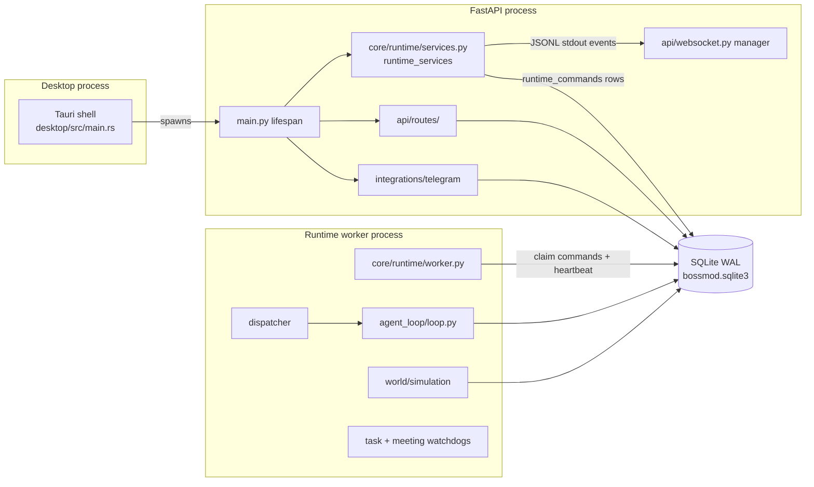
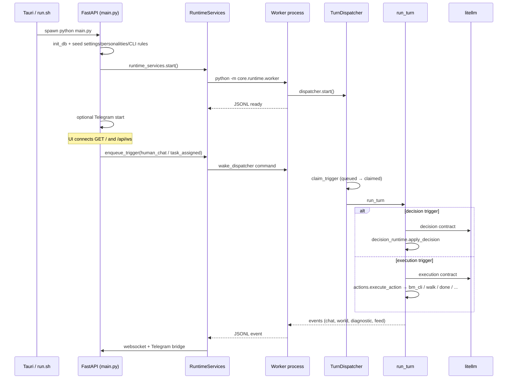
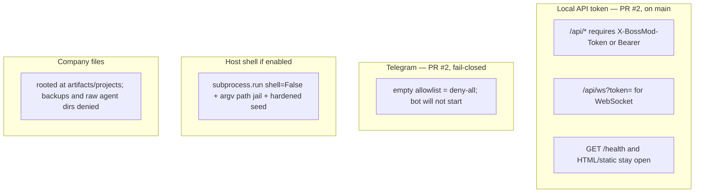

# BossMod AI — Current-state architecture

**As of:** current tree after PR #2 and the HA-* health landings (2026-09-05). This is a map of what exists, not a target design. [`HEALTH_AUDIT.md`](HEALTH_AUDIT.md) is a **snapshot** of `main` @ `f5405bc` and is not current for security status.

## Process topology

Two Python processes share one SQLite file. The app process owns HTTP, WebSocket, Telegram, and settings. The worker owns the agent loop, world tick, and watchdogs. They coordinate through `runtime_commands` / `runtime_worker_state` plus a JSONL event pipe on the worker's stdout.

## Boot → first agent turn

## Major packages

| Package | Role today |
| --- | --- |
| `main.py` | FastAPI app, lifespan, `/` + `/health`, binds `127.0.0.1:38471` |
| `api/` | Split routers under `api/routes/` (`ws`, `agents`, `tasks`, `company_files`, `settings`, `cli_policy`, `runtime`) + WebSocket manager. Largest leftover: `agents.py` (~808 LOC). |
| `core/runtime/` | App↔worker gateway (`RuntimeServices` singleton) and worker loop |
| `core/agent_loop/` | Trigger dispatch, decision/execution turns, meetings, channels, watchdogs |
| `core/bm_cli/` | Virtual CLI + optional host shell + managed writer |
| `core/tasking/` | Create/bind tasks, board, resolution |
| `core/llm/` | Context assembly, template engine, litellm client, routing |
| `core/world/` | Tilemap + A* movement tick |
| `core/config.py` | Process-wide settings cache over `settings` table |
| `db/` | SQLite access; `db/__init__.py` re-exports ~200 symbols |
| `integrations/telegram/` | Bot commands, in-memory chat sessions, approval buttons |
| `ui/` | Vanilla JS IIFEs + vendored Tailwind/Lucide/Split + Jinja `index.html` |
| `desktop/` | Tauri 2 wrapper; records backend PID and signals that process on relaunch |
| `prompts/` | Authored contracts, personalities, internal repair/continue text |
| `plugins/` | Empty directory (no plugin loader) |

## Coupling hotspots

- **God objects / process globals:** `runtime_services`, `dispatcher`, `simulation`, `watchdog`, `meeting_watchdog`, `policy_engine`, `manager` (WebSocket), `runtime_events`, `config._cache`.
- **Layer inversion:** `RuntimeServices` broadcasts through an `EventSink` set in `main.py` lifespan (`set_event_sink(manager)`). `core/` does not import `api`. Worker code still aliases `runtime_events as manager` so the same call sites work in both processes.
- **Barrel import:** almost all persistence goes `import db` → `db/__init__.py`. Easy to call, hard to fake in tests.
- **Dual enqueue:** API/Telegram use `runtime_services.enqueue_trigger` (cross-process). Worker-side watchdogs/meetings use `dispatcher.enqueue_trigger` (in-process). Correct given the split; easy to call the wrong one from new code.
- **Lazy imports** inside functions (`from core.world.simulation import simulation`, `from core.bm_cli.runtime import execute_approved_command`) paper over cycles rather than invert dependencies.

## Trust boundaries (current tree)

**Shipped on `main` (do not describe as open):**

- **PR #2** — local API token (`X-BossMod-Token` / `Authorization: Bearer`) on `/api` REST and WebSocket; settings/connections redact secrets; Telegram empty allowlist is deny-all and refuses start.
- **HA-SEC-P0-04** — company browser root is `artifacts/projects`; `db_backups/` and raw `agents/` are outside it.
- **HA-SEC-P0-03 / HA-SEC-P1-04** — shell path jail; interpreters / `xargs` / POSIX shells are `never_allowed`; argv[0] basename matching.

Residual (not “auth is missing”): `/health` and the HTML/static UI stay unauthenticated by design. Connection-test URLs are allowlisted (HA-SEC-NEW-01, shipped). Every HA-* item in [`HEALTH_BACKLOG.md`](HEALTH_BACKLOG.md) is shipped on current `main`; that file is the historical sequence plus out-of-scope notes, not an open queue. See [`HEALTH_VERIFICATION.md`](HEALTH_VERIFICATION.md) for the latest verification pass.
