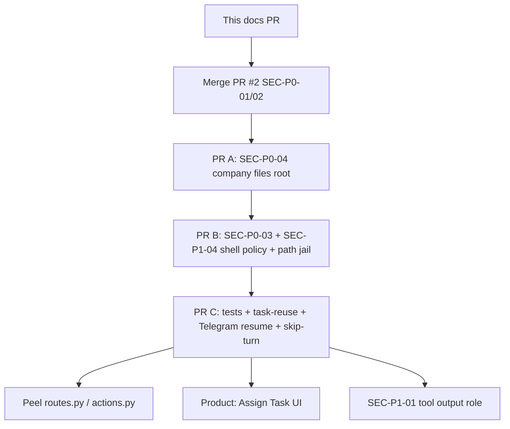

# BossMod AI — Project health audit

**Repo:** https://github.com/JTechMinds/bossmodai  
**Branch audited:** `main` @ `f5405bc` (“loop bugfixes”)  
**Compared against:** open PR #1 (`docs/AUDIT_P0_P1.md`) and open PR #2 (`cursor/sec-p0-01-p0-02-b82e`)  
**Scope:** architecture, monoliths, DRY/KISS, DI/boundaries, correctness/glitches, product vs README, tests, remaining security, ops/DX  
**Method:** local clone of latest `main`; PR #2 inspected via `git show` (not merged). No application refactors in this PR.

Companion docs: [`ARCHITECTURE.md`](ARCHITECTURE.md) (current-state diagrams), [`HEALTH_BACKLOG.md`](HEALTH_BACKLOG.md) (PR-sized work items).

---

## Executive summary

BossMod is a real product, not a prototype sketch. The runtime already has a durable trigger queue, a separate worker process, decision vs execution contracts, a virtual CLI, meetings/channels, Telegram, and a Tauri desktop shell. That is more structure than the test suite and file sizes suggest.

The health problem is **concentration + thin verification**, not missing features:

1. **A handful of files own too much.** `api/routes.py` (2293), `actions.py` (2251), `loop.py` (1723), `decision_runtime.py` (1367), `managed_writer.py` (1851), `context_builder.py` (1229), and several 1k–2k JS files. Splits are obvious; a rewrite is not.
2. **Security batch #1 is in flight, not done.** PR #2 covers SEC-P0-01 (Telegram fail-closed) and SEC-P0-02 (redact secrets + local API token). On current `main` those P0s are still live. Remaining P0s — shell host escape (SEC-P0-03) and company-files root over `artifacts/db_backups/` (SEC-P0-04) — are untouched.
3. **Critical behavior is almost untested.** `tests/` on `main` is one 42-line meeting-kickoff test. `scripts/run_runtime_smoke_suite.sh` points at `tests/test_agent_runtime.py` cases that **do not exist**. PR #2 adds Telegram/API security tests only.
4. **The operator cannot assign a task from the UI.** README promises “assign real work.” `POST /api/tasks` exists; no JS calls it. Chat is the only first-class human → work path. Company Tasks is a read-only board.
5. **Two more correctness P0s on the approval / skip paths.** Telegram `/approve` and callback buttons write the approval row but never enqueue `cli_approval_resolved` (desktop does). A no-model skip returns `trigger_status="skipped"`, which the dispatcher treats as non-retryable failure and **exhausts** the trigger (and can stall the task).
6. **Globals and a `db` barrel make the interesting code hard to unit-test.** `runtime_services`, `dispatcher`, `policy_engine`, `manager`, `config._cache` are process singletons. `core/runtime/services.py` imports `api.websocket`.

**Do not rewrite.** Land PR #2, close the two remaining security P0s, restore a critical-path test suite, then peel monoliths and fix the task/meeting glitches in small PRs.

### Status of prior security work

| ID | Topic | On `main` | PR #2 (open) |
| --- | --- | --- | --- |
| SEC-P0-01 | Telegram allowlist fails open | **Still live** (`integrations/telegram/bot.py` `_check_auth` returns `True` when allowlist empty) | Fixed: deny-all + refuse start |
| SEC-P0-02 | Unauthenticated API returns secrets / destructive controls | **Still live** (no middleware; `GET /api/settings` + connections return raw keys) | Fixed: token gate + redaction |
| SEC-P0-03 | Shell not a sandbox | **Still live** | Not in scope |
| SEC-P0-04 | Company files root includes `db_backups/` | **Still live** | Not in scope |
| SEC-P1-01…08 | See security section | Still live (TEST-P1-08 partially addressed by PR #2) | Partial (auth tests only) |

---

## 1. Architecture map

See [`ARCHITECTURE.md`](ARCHITECTURE.md) for mermaid. Short version:

**Boot:** `run.sh` → Tauri (`desktop/src/main.rs`) stops a recorded backend PID if it is still this repo’s `main.py` → FastAPI `lifespan` → `init_db` (schema + seed settings/personalities/CLI rules) → `runtime_services.start()` spawns `python -m core.runtime.worker` → worker starts dispatcher, simulation, task watchdog, meeting watchdog → optional Telegram.

**Agent turn:** API/Telegram persist a row in `agent_triggers` and wake the worker via `runtime_commands`. Dispatcher claims one trigger per agent (`_active_turns`), calls `run_turn` (`loop.py`). Decision triggers (`human_chat`, `task_assigned`, meeting/channel responses, …) go through `decision_runtime.apply_decision`. Execution triggers loop LLM → `actions.execute_action` (CLI, walk, complete, delegate, …). Results become more triggers, WebSocket events, Telegram bridge events, diagnostics.

**Tools:** `bm_cli` is a virtual FS/git/state CLI. Optional host `shell` goes through `policy_engine` then `shell_executor` (`subprocess.run(..., shell=False)`). Approvals pause the turn; `execute_approved_command` **bypasses policy**.

**UI:** Vanilla JS IIFEs talk REST + one WebSocket. Tailwind / Lucide / Split.js load from CDN (contradicts “completely offline”).

**Coupling hotspots**

| Hotspot | Why it hurts |
| --- | --- |
| `api/routes.py` | HTTP + company FS + CLI policy + settings + task create + connection SSRF-adjacent test |
| `core/agent_loop/loop.py` + `actions.py` + `decision_runtime.py` | One turn spans three god-files; task/meeting/CLI side effects mixed in |
| `db/__init__.py` (456 LOC barrel) | Every consumer depends on everything |
| `core/runtime/services.py` → `api.websocket` | Core cannot be imported without the HTTP layer |
| Process globals listed in ARCHITECTURE.md | Tests must patch modules, not inject ports |

**What is already in good shape**

- App vs worker process split with durable commands and parent-death watchdog.
- `core/messaging.py` shared by web + Telegram for human DMs/channels (real DRY).
- `db/crud.py` parameterized queries; virtual FS `resolve_relative_path` rejects `../`.
- `file_explorer.py` is already DI-friendly (caller passes opener).
- Settings-view JS is already section IIFEs in one file — mechanical split.

---

## 2. File / module size and monoliths

Counts exclude vendor JS. Threshold used here: **>500 LOC = review for split; >1000 = monolith.**

| File | LOC | Responsibilities today | Suggested PR-sized split |
| --- | --- | --- | --- |
| `api/routes.py` | 2293 | All REST + WS endpoint + company-files helpers + Pydantic bodies | `api/routes/{agents,tasks,company_files,settings,cli_policy,runtime,ws}.py` + keep a thin `router` aggregator. Bodies → `api/schemas.py`. |
| `core/agent_loop/actions.py` | 2251 | Action parse/validate + every execution handler + task follow-up/stakeholder reports | Keep `execute_action` + parse in `actions.py`. Move handlers to `actions_work.py`, `actions_tasks.py`, `actions_meetings.py`, `actions_cli.py`. Follow-up helpers → `task_followups.py` (already half-duplicated with `decision_runtime`). |
| `ui/static/js/settings-view.js` | 1921 | Shell + Connections + Personalities + System + Telegram + Advanced + Prompt + Contracts | File already has IIFEs (`ConnectionsSection`, …). Move each IIFE to `settings/*.js`. |
| `core/bm_cli/managed_writer.py` | 1851 | Single/batch/section rewrite, prompt render, manifest parse, assembly | `managed_writer/{single,batch,section,parse,prompts}.py`. |
| `core/agent_loop/loop.py` | 1723 | `run_turn`, `_run_decision_turn`, continuation/repair, CLI approval pre-exec, diagnostics finalize | `turn_runner.py` (execution loop), keep `loop.py` as router; repair builders already want `prompting/`. |
| `ui/static/js/agent-context.js` | 1543 | Select agent, chat, desk, meeting, tasks subview, channel open | `agent-chat.js`, `agent-desk.js`, `agent-meeting.js`; leave context controller thin. |
| `core/agent_loop/decision_runtime.py` | 1367 | `apply_decision` + persist reply + work plan + clarification loop + task bind | `decision_apply.py` + `decision_work_plan.py` + `decision_task_bind.py`. |
| `ui/static/js/cli-policy-section.js` | 1323 | Rules table, settings, **live simulator**, approvals, virtual-command catalog | Simulator is a product surface — `cli-simulator.js` + `cli-rules.js`. |
| `core/llm/context_builder.py` | 1229 | Live context + preview/fake context for Settings | Split `_preview_*` / `preview_runtime_contract` into `context_preview.py`. |
| `ui/static/js/app.js` | 709 | Tabs, split, WS, pause button, company mode | Acceptable; extract `ws-client.js` when PR #2 auth lands. |
| `core/bm_cli/command_registry.py` | 595 | Frozen metadata only | Fine (data, not logic). |
| `core/agent_loop/dispatcher.py` | 585 | Claim, run, retry, social probe, backlog rebuild | Social probe could move; not urgent. |
| `ui/static/js/company-tasks.js` / `company-files.js` | 564 / 554 | Board + browser | Fine once fetch helper exists. |
| `db/__init__.py` | 456 | Re-exports | Keep, but stop growing it; new code should import `db.tasks` etc. |
| `db/connection.py` | 465 | SQLite + DuckDB-era SQL rewrite (`$1`, `ILIKE`, `SHOW TABLES`) + migrations + reset/backup | Migrations → `db/migrations.py`. |

`ui/static/js/vendor/highlight.min.js` (1243) is third-party — ignore.

---

## 3. DRY / duplication

| Pattern | Paths | Why it matters |
| --- | --- | --- |
| Meeting vs channel response rounds | `db/meeting_response_rounds.py` ≈ `db/channel_response_rounds.py`; `core/agent_loop/meeting_rounds.py` ≈ `channel_rounds.py` | Near line-for-line copies (session_id vs channel_id). Bugfixes will drift. Extract `response_rounds.py` parameterized by table. |
| Task follow-up / attention / stakeholder reports | `actions.py` `_append_task_follow_up_message`, `_append_task_stakeholder_reports`, `_effective_attention_kind` vs `decision_runtime.py` `_persist_task_follow_up_reply`, `_task_turn_attention_kind` | Dual implementations of “who must be told.” Hunch: clarification loops and `done` follow-ups will disagree. |
| Human ingress | `core/messaging.py` already shared — **good**. Do not re-split. | |
| Enqueue trigger | `RuntimeServices.enqueue_trigger` vs `TurnDispatcher.enqueue_trigger` — same payload, different process. | Document as the official boundary; add a single typed helper used by both. |
| JS `fetch('/api/...')` | `app.js`, `agent-context.js`, settings sections, `cli-policy-section.js`, `company-*.js`, `channels-view.js`, `diagnostics.js`, `activity.js` | Closed by HA-STRUCT-P1-08: call sites use `apiFetch()` in `api-client.js`; `api-auth.js` still wraps `window.fetch`. |
| Company path resolve vs CLI path resolve | `api/routes.py` `_resolve_safe_company_path` vs `core/bm_cli/filesystem.resolve_relative_path` | Same algorithm, two copies. |
| Settings `int()` | `config.get_int` is `int(val)` with no `ValueError` guard; many call sites `or 300` | Bad setting crashes the worker loop. |
| Prompt repair / continue | `prompts/internal/loop_*_repair_*.md` + builders in `loop.py` | Dense but localized; split with `loop.py`, don’t invent a framework. |

---

## 4. KISS / complexity

**Over-engineered (keep, but don’t grow until tested)**

- Decision + execution contracts, repair loops, continuation instructions, communication snapshots, prompt-history policies, managed writer (single / batch / sectioned). This is the product’s differentiator and also the reason `loop.py` / `context_builder.py` / `managed_writer.py` are huge.
- CLI policy engine (DB rules, three match modes, simulator that **executes for real**).
- Activity graph (work / meeting / conversation / movement) sitting beside task status and agent_state status — three overlapping state machines.

**Under-structured**

- Task status is a CHECK constraint + `db.update_task(**fields)` with **no transition table**. Any caller can write `pending → complete` or `complete → active`.
- No human “assign task” UI despite `POST /api/tasks` and a Company Tasks board.
- `plugins/` is an empty directory; `pyproject.toml` still depends on unused `duckdb` and optional unused `twilio`.
- Config philosophy (“no hardcoded defaults”) is already broken: meeting watchdog keys are **not seeded** and fall back in code (`meeting_watchdog.py`).

**About right**

- World sim (181 LOC), tilemap, pathfinding.
- `core/messaging.py`, `file_explorer.py`, `core/time.py`.
- Template engine (constrained, no eval) — prior audit agreed.

---

## 5. DI / boundaries

| Symptom | Evidence | Effect |
| --- | --- | --- |
| Process singletons | `runtime_services = RuntimeServices()`; `dispatcher = TurnDispatcher()`; `policy_engine = PolicyEngine()`; `manager = ConnectionManager()`; `meeting_watchdog = MeetingWatchdog()` | Unit tests must mutate globals. |
| Settings cache | `core/config.py` module `_cache` + `reload()` | Easy to read stale values after `set_setting` if a caller forgets `reload()`. |
| `import db` barrel | `db/__init__.py` | Circular-import pressure; lazy imports in `connection.init_db`. |
| Core → API import | `core/runtime/services.py` line 16 `from api.websocket import manager` | Worker never imports this path (uses `runtime_events`); app process does. Still a layer violation. |
| Hard-wired LLM | `loop.py` → `core.llm.client` / litellm | No fake client for turn tests (hence the missing `test_agent_runtime.py`). |
| Telegram sessions | `integrations/telegram/sessions.py` in-memory | Lost on restart; not the same as `meeting_sessions` in DB. |
| SQLite thread-local + `check_same_thread=False` | `db/connection.py` | Two processes, many threads; WAL + `busy_timeout=5000` is the real concurrency story. Fine for desktop; not proven under load. |

**Testability target (incremental):** inject `enqueue_trigger`, `execute_bm_cli`, and an LLM client at the dispatcher/loop edge. Do not convert the whole app to a container.

---

## 6. Correctness and glitches

Severity here is **behavior/data-loss**, not style.

### P0 / near-P0

| Finding | Evidence | Why |
| --- | --- | --- |
| **Reused task does not wake the assignee** | `api/routes.py` `create_task`: enqueue only if `creation.outcome == "create_new_task"`. `create_or_bind_task` can return `bind_existing_task`. | Human (or later UI) “assigns the same workstream” again → 201-ish reuse, **no `task_assigned` trigger**. Silent no-op. |
| **Telegram CLI approval does not resume the agent** | `integrations/telegram/bot.py` `cmd_approve` / `handle_approval_callback` call `approve_cli_approval_request` / `reject` only. Desktop `api/routes.py` `approve_cli_request` also creates `cli_approval_resolved`. | Buttons look successful; agent stays paused. Approval-bypass (`execute_approved_command`) never runs from Telegram. |
| **No-model skip permanently fails the trigger** | `outcomes.py` `skipped` → `trigger_status="skipped"`. Dispatcher only retries `"failed"`; anything else goes to `_exhaust_failed_trigger` (fail trigger, possibly stall task). `_skip_turn` also sets the task `blocked` when `trigger.task_id` is set. | First-run / missing model **drops the human message** and can stall work. |
| **Company files can read/delete DB backups** | `_build_company_files_payload` + `artifacts_root()`; `reset_database()` writes `artifacts/db_backups/*.bak` | Same as SEC-P0-04; also a data-loss path (Delete in the file browser). |

### P1

| Finding | Evidence | Why |
| --- | --- | --- |
| **Ambiguous task match creates a duplicate** | `resolution.py` can return `clarify_ambiguous_match`; `create_or_bind_task` only special-cases `bind_existing_task` then always `create_task`. | Two open “Plan” tasks instead of a clarify. |
| **`task_assigned` waits forever if any activity is active** | `activity_scheduler.can_dispatch_trigger`: `task_assigned` requires `active_activity is None`. | New assignment sits `queued` through a meeting/chat/walk. |
| **Desktop CLI approve does not wake the worker** | `approve_cli_request` uses `db.create_agent_trigger` directly, not `runtime_services.enqueue_trigger`. | Trigger exists; worker may sleep until the next poll/other wake. |
| **`expire_stale_requests` is never called** | `db/cli_approval_requests.py` defines it; no worker/watchdog caller. | Expired approvals leave agents mid-pause. |
| **Task status has no state machine** | `db/tasks.py` `update_task` accepts any CHECK-legal status | Watchdog, reset-runtime, skip-turn, and agent `done` all write status independently. Easy to strand `accepted` forever (watchdog only lists `status="active"`). |
| **Watchdog ignores non-active work** | `watchdog.py` `_check_tasks`: `db.list_tasks(status="active")` | `accepted` / `waiting` / `pending` never get a ping. Matches “assignment bugs exist” commit history. |
| **Telegram `/meeting` is a channel, not a meeting** | `bot.py` `cmd_meeting` → `_open_group_session` → `create_channel` | Desktop meetings are `meeting_sessions` + room assembly + watchdog. Telegram “meeting” never hits that state machine. Product mismatch + two group-chat implementations. |
| **Stale-claim requeue is crash-recovery, not a live double-run** | `requeue_stale_triggers` is only called from `dispatcher.start()` | Prior audit (SEC-P1-02) overstated live duplication. Residual: after worker crash, a mid-turn trigger is replayed → duplicate CLI writes / messages. No lease token / `claimed_at` heartbeat. |
| **Approval prefix is first-match** | `bot.py` `_resolve_approval_by_prefix` | Short prefixes can approve the wrong pending command (SEC-P1-03). |
| **`execute_approved_command` skips policy and path jail** | `runtime.py` | After UI/Telegram approve, argv is unconstrained. |
| **`config.get_int` throws** | `int(val)` | Corrupt setting → watchdog/dispatcher exception loop. |
| **Reset-runtime blocks only the first open activity’s task** | `routes.py` `reset_agent_runtime` uses `open_activities[0]` | Other in-flight tasks stay `active` with cancelled activities. |
| **Typing-indicator / no-reply chat** | `agent-context.js` hides indicator on HTTP return; walk/idle produces no WS chat | Works, but user sees “sent” with no agent line — easy to think chat is broken. Hunch: more UX than logic. |

### P2 / hunches

- `create_or_bind_task` title-normalized matching can glue unrelated workstreams with the same short title (“Plan”, “Notes”).
- Social idle probe (`dispatcher._maybe_enqueue_social_trigger`) is clever and untested.
- `POST /api/tasks` returns a `Task` without telling the client it was a reuse (`outcome` is dropped).
- SQLite table rebuilds disable FK briefly (`connection.py`) — acceptable locally; don’t copy to a hosted deploy.

---

## 7. Behavior vs intended product

Sources: `README.md`, `prompts/system_prompt.md`, Settings/Company UI, `strategy-docs/scenario_matrix_evals.md`.

| Intended | Actual |
| --- | --- |
| “Assign real work” / First 5 minutes: hire + assign a task | **No Assign Task control.** Chat → decision runtime *may* create a task. Company Tasks is GET-only. Agent Tasks subview is GET `/tasks/board` only. |
| “9 ready-made personalities” | **Correct.** Nine names are seeded from `core/default_prompts.py`. `personalities/default_role.md` is the fallback for agents with no personality, not a tenth catalog entry. |
| “Works with any model” / connect a brain first | True if the user follows the README. If they hire first, turns skip (`No model configured`) and may **block** a task. No modal blocks chat. |
| “Use a local model and the entire workflow is completely offline” | UI loads Tailwind, Lucide, Split.js from **CDN**. Tauri CSP explicitly allows `cdn.tailwindcss.com` and `unpkg.com`. Offline first-run = broken chrome. |
| “Your API keys never leave your computer” | Keys live in plaintext SQLite; company-files can expose backups; `GET /api/settings` and connections leak them on `main`. |
| “Stay in control — Emergency Pause” | Implemented (`PUT /api/runtime/state`). Unauthenticated on `main`. |
| Telegram `/meeting` = all-agent group | Implemented as a **channel**, not a spatial meeting with invites/arrival timeouts. |
| System prompt: task board is authoritative; don’t invent new work | Runtime tries (`resolve_existing_task`) but reuse doesn’t re-notify; board UI can’t create/edit. |
| Scenario matrix (`strategy-docs/scenario_matrix_evals.md`) | Spec only. Smoke script names the tests; files are gone. |
| README stack table: SQLITE | Runtime is SQLite. `duckdb` is an unused dependency; `connection.py` still rewrites DuckDB-ish SQL (`$1`, `ILIKE`). |

---

## 8. Test strategy

**On `main` today**

| File | What it covers |
| --- | --- |
| `tests/conftest.py` | Isolates `BOSSMOD_DB_PATH` to a temp file (good) |
| `tests/test_meeting_orchestrator.py` | Kickoff waits until every participant is arrived/declined |

**Missing (critical path)**

- Agent turn: decision accept → task + activity → execution `cli`/`done` (the deleted smoke list is the right pyramid seed).
- Dispatcher claim / retry / human preemption / backlog rebuild.
- Task create-or-bind + assignee trigger.
- CLI policy: interpreters/`xargs`, absolute paths, approval bypass.
- Company-files path containment + deny `db_backups`.
- Telegram allowlist (PR #2 adds this).
- Secret redaction + unauthenticated reseed (PR #2 adds this).
- WebSocket auth (PR #2).
- Meeting watchdog timeouts; channel vs meeting parity.
- Frontend: no tests at all.

**Suggested pyramid (small)**

1. **Pure functions first:** policy match, path resolve, Telegram allowlist parse, task resolution, action parse.
2. **DB + service (temp SQLite):** `create_or_bind_task` + trigger enqueue; meeting kickoff (exists); company path root.
3. **One faked-LLM turn test:** human_chat that accepts work; `done` without deliverable rejected.
4. **Do not** start with browser/Tauri E2E.

Restore `scripts/run_runtime_smoke_suite.sh` against real files or delete the script — a lying smoke script is worse than none.

---

## 9. Remaining security

Do **not** redo PR #2. Verify leftovers after it lands.

### Still P0 on `main` (and after PR #2)

**SEC-P0-03 — Shell enablement is not a sandbox**  
`shell_executor.py` uses `shell=False` + env allowlist (real mitigations) but cwd is not a jail; absolute paths work. Seed `always_allowed` includes `python`, `python3`, `node`, `cat`, `find`, `xargs` (`db/cli_policy_rules.py`). `never_allowed` omits `bash`/`sh`/`zsh`. Default `cli_shell_enabled=false`. `execute_approved_command` skips policy. Logs full `command=%r`.

**SEC-P0-04 — Company files root is `artifacts/`**  
List/read/raw/write/delete/rename/move/copy/search all use `artifacts_root()`. Backups from `reset_database()` land in `artifacts/db_backups/`. Path guard is correct *inside* that root — the root is too wide. Also serves agent workspaces and `.env`-like extensions (`_TEXT_FILE_EXTENSIONS` includes `.env`).

### P1 from prior audit (still valid)

| ID | Notes after this pass |
| --- | --- |
| SEC-P1-01 | `loop.py` wraps `cli_prompt_content` as `role=system`. Confirmed. |
| SEC-P1-02 | Downgrade live-duplicate claim; keep as **crash replay** without leases. |
| SEC-P1-03 | Approval prefix first-match. Confirmed. |
| SEC-P1-04 | `xargs` always_allowed; no `sh`/`bash` never_allowed. Confirmed. |
| SEC-P1-05 | Secrets at rest plaintext; Agent `exclude=True` doesn’t cover connections/settings routes on `main`. |
| SEC-P1-06 | Simulator execute is unauthenticated on `main`; PR #2 gates it with the token (still “real execute”). |
| LOOP-P1-07 | Meeting watchdog keys absent from `_SEED_SETTINGS`. Confirmed. |
| TEST-P1-08 | Still true on `main`; PR #2 adds two security test modules. |

### New / extra (not in PR #1)

| ID | Severity | Evidence | Notes |
| --- | --- | --- | --- |
| SEC-NEW-01 | P1 on `main`, P2 after PR #2 | `POST /api/connections/test` `httpx.get(base + "/models")` with caller-supplied URL | Classic local SSRF. Token-gate reduces who can fire it. |
| SEC-NEW-02 | P2 | `desktop/src/main.rs` `pkill -f` on the `main.py` path | Can kill unrelated processes if the path is a common substring. Prefer recorded PID. |
| SEC-NEW-03 | P2 | `PYTHONPATH` / `PYTHONHOME` in `_SAFE_ENV_NAMES` | Interpreter escape aid when shell is on. |
| SEC-NEW-04 | P1 product/security | CDN scripts + Tauri CSP allowlist | Offline claim false; supply-chain on every launch. |
| SEC-NEW-05 | P2 after PR #2 | Token injected into `index.html`; WS `?token=` | Stops drive-by CSRF from random sites (they lack the token). Residual: XSS/extension can read the page; query-string token hits logs. No Origin check. |
| SEC-NEW-06 | P2 | `/health` open, static `/` open | Correct for desktop. Don’t “fix” by locking `/`. |
| SEC-NEW-07 | P2 | FastAPI `/docs` + `/openapi.json` (PR #2 middleware is `/api/*` only) | Documents destructive routes. Disable docs in the desktop build. |
| SEC-NEW-08 | P1 on `main`, P2 after PR #2 | `GET /api/diagnostics/{id}` returns full prompt/context blobs | Can echo secrets from tool output. Redact or gate separately. |

Virtual FS traversal and `shell=True`/`eval`/`pickle` — still clean (agree with PR #1).

---

## 10. Ops / DX

| Footgun | Detail |
| --- | --- |
| `./run.sh` | Requires `uv`, **Rust/Cargo**, bash. First release build is slow; script only rebuilds if three desktop files change (not `Cargo.lock` / icons). |
| Windows | `run.sh` + `pkill` + `.venv/bin/python` — not a Windows-native path. README says WSL. |
| First run, no model | App opens; agents can be hired; chat “succeeds” HTTP and then skip-turn. Easy to think the product is broken. |
| `BOSSMOD_HOST` | Backend honors it; Tauri forces `127.0.0.1`. Binding `0.0.0.0` via `uv run python main.py` exposes the unauthenticated API on `main`. |
| `docs/*` in `.gitignore` | Audit markdown could not be committed without a force-add or exception. This PR adds `!docs/*.md`. |
| `strategy-docs/*` gitignored but tracked | Confusing; memory-bank is stale (`ea4794d`, claims 24 agent_loop files). |
| Unused deps | `duckdb` always installed; `twilio` optional unused. Inflates `uv sync`. |
| Smoke script | `scripts/run_runtime_smoke_suite.sh` fails immediately — missing tests. |
| Diagnostics default off | `diagnostics_enabled=false` — good for cost; first-run debugging is harder. |

---

## Recommended sequencing

**After this docs PR lands, the next three implementation PRs should be:**

1. **Company files root** (SEC-P0-04) — smallest remaining P0, clear tests, no behavior change for project files.
2. **Shell seed + argv path confinement** (SEC-P0-03 + SEC-P1-04) — do this before anyone is told to enable shell.
3. **Critical-path tests + task-reuse + Telegram resume + skip-turn** (HA-TEST-P1-01, HA-CORR-P0-01/02/03) — puts a net under the loop and unblocks two live P0s.

Do **not** start monolith splits until (3) exists. Do **not** rewrite `loop.py` as a platform.

---

## Findings index (by theme)

| Theme | Highest-leverage items (see backlog IDs) |
| --- | --- |
| Remaining security | HA-SEC-P0-03, HA-SEC-P0-04, HA-SEC-P1-01, HA-SEC-P1-04, HA-SEC-P1-03 |
| Structure / DI | HA-STRUCT-P1-01 (routes), HA-STRUCT-P1-02 (actions), HA-STRUCT-P1-06 (core→api), HA-STRUCT-P1-07 (rounds DRY) |
| Correctness / glitches | HA-CORR-P0-01, HA-CORR-P0-02, HA-CORR-P0-03, HA-CORR-P1-02, HA-CORR-P1-03, HA-CORR-P1-04 |
| Tests | HA-TEST-P1-01, HA-TEST-P1-02, HA-TEST-P1-03 |
| Product / DX | HA-PROD-P1-01 (assign-task UI), HA-OPS-P1-01 (no-model guard), HA-OPS-P1-02 (CDN/offline) |
